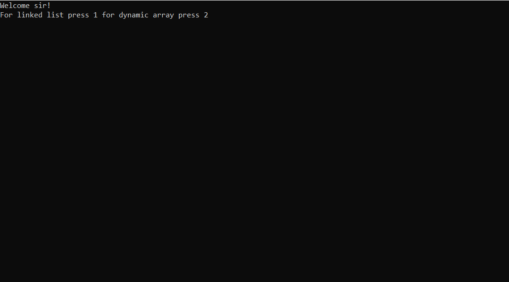

# Introduction
In this project we have made the dynamic array and linked list from scratch.

# Index 
1. We will start with [how to run the program](#How-to-run-the-program)
2. [How does it work](#How-does-it-work)

## How to run the program
Click on the student.exe file after compilation

## How does it work
Once you start the program the cmd will ask you to choose between dynamic array or linked list to use.
If you choose dynamic array -pressed 2- it will ask you to enter number of students

